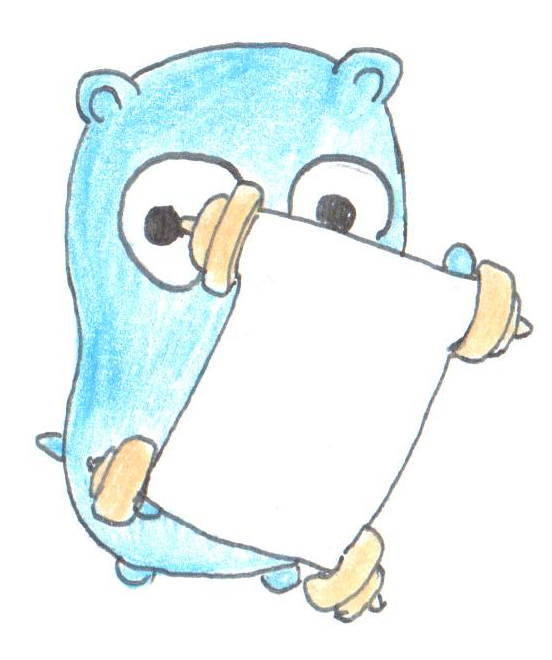

# go-all-in

Image credit to https://github.com/egonelbre/gophers

This repository contains my notes and explorations of go. Inspired by Josh Duffney's [Everything I Know About Go](https://github.com/Duffney/everything-i-know-about-go).

## Contents

* **[Middleware](middleware/):** How do you write middleware for Go REST APIs? Plus a bit of structured logging using [`zap`](https://github.com/uber-go/zap).
